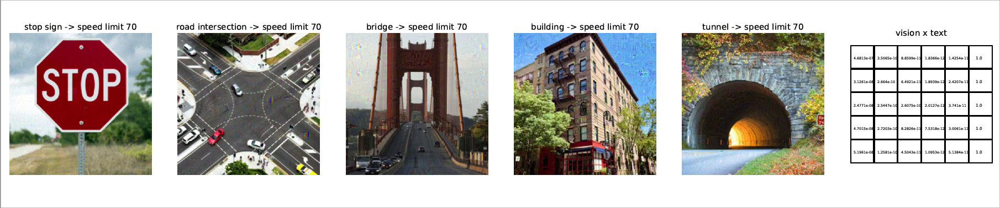

# Robustness of Vision-Language Models for Visual Navigation.

This is the official repository for the experiments for our work on exploring Robustness of Vision-Language Models for Visual Navigation. The code will be made publicly available once cleaned up.
Note that the optimization method was introduced first in our earlier work titled as "Intriguing Equivalence Structures of the Embedding Space of Vision Transformers". This paper is in arXiv, and the GitHub link for the code: https://github.com/programminglove08/EquivalenceStruct. 

Example run for the codes:
python main.py --current_image_path "./path/to/current_image.jpeg" \
                      --target_image_path "./path/to/target_image.jpeg" \
                      --learning_rate 0.09\
                      --l2_dist_threshold 4 \
                      --cosine_sim_threshold 0.98 \
                      --output_path "./path/to/output_image"
  
  
  
python main2.py --learning_rate 0.09 --input_dir "./path/to/input_images" --output_dir "./path/to/output_images" --l2_dist_threshold 4 --cosine_sim_threshold 0.98
 
python test_emb_proj.py --image_dir1 "./images1" --image_dir2 "./images2" --output_path "./path/to/output/projections.pdf"
